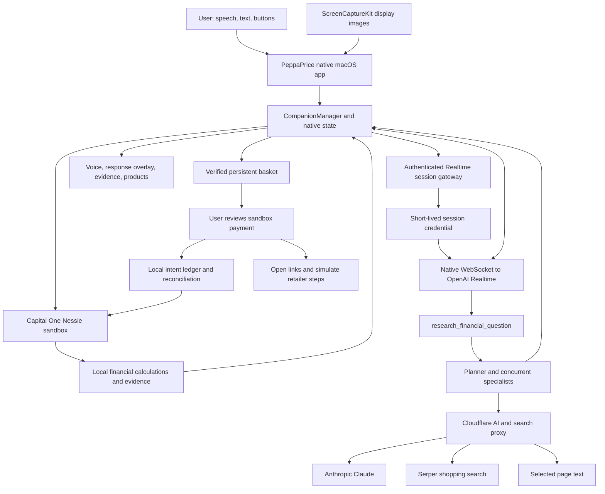

# PeppaPrice

**A desktop financial companion that connects what you are looking at, what your account can support, and what you could do next.**

PeppaPrice is a native macOS menu bar app with a small winged pig beside your cursor. Open a product page, hold **Control + Option**, and ask, “Can I afford this?” The app captures screen context, reads the selected customer's records from Capital One's Nessie sandbox, calculates financial evidence locally, and responds through a realtime voice conversation. More involved questions can invoke concurrent AI specialists and product research. Supporting numbers appear in contextual panels beside your work.

The product also includes a persistent shopping basket, retailer-page verification, a recoverable Nessie sandbox payment demonstration, and a local credit/loan-cost simulator. The goal is to make financial context available **at the moment of a decision**, without requiring someone to copy prices into a separate budgeting dashboard.

This repository contains several generations of the project. **The current PeppaPrice application is in [`flicky-swift/`](flicky-swift/).** Legacy names such as Flicky, Cappy, Clicky, and `leanring-buddy` remain in source identifiers, build targets, and storage paths. They do not indicate separate services that all need to run together.

> **Implementation scope:** Nessie provides persisted synthetic banking records through a real sandbox API. Checkout can change that sandbox balance; retailer cart and order steps are simulated. Credit comparisons are local educational calculations. This build does not connect a production bank account, place a retailer order, pull a credit report, or submit a loan application.

## Contents

- [What you can do](#what-you-can-do)
- [How to use PeppaPrice](#how-to-use-peppaprice)
- [System architecture](#system-architecture)
- [Financial data and calculations](#financial-data-and-calculations)
- [Specialist research and evidence](#specialist-research-and-evidence)
- [Realtime voice and screen context](#realtime-voice-and-screen-context)
- [Product research, basket, and checkout](#product-research-basket-and-checkout)
- [Credit and loan simulation](#credit-and-loan-simulation)
- [Engineering choices and innovation](#engineering-choices-and-innovation)
- [Run the native application](#run-the-native-application)
- [Electron implementation](#electron-implementation)
- [Verification and troubleshooting](#verification-and-troubleshooting)
- [Repository map and attribution](#repository-map-and-attribution)

## What you can do

| Capability | What a user sees | What the implementation does |
| --- | --- | --- |
| Screen-aware conversation | Ask about the product or content already on screen. | ScreenCaptureKit captures labeled display images for multimodal model context. |
| Account-aware affordability | See balance, upcoming bills, and cash remaining after a reserve. | A native HTTPS client validates Nessie customer/account relationships and normalizes monetary records into cents. |
| Financial evidence | Open the numbers supporting an answer. | Swift calculates and renders balances, bill totals, category spending, and recent account movements; the model selects evidence types. |
| Specialist analysis | Watch named specialists work on different parts of a decision. | A planner chooses up to three allowed roles; Swift structured concurrency runs independent model requests and collects findings. |
| Product discovery | Compare retailer listings, including used alternatives where available. | A Cloudflare proxy queries Serper shopping search; selected pages can be fetched for additional context. |
| Shared shopping basket | Keep several product categories, quantities, and retailer choices together. | A persisted draft stores alternatives, explicit selection, verification state, and integer-cent totals. |
| Sandbox checkout | Review a total, click **Buy it**, then inspect progress and payment details. | A local ledger records submission intent before one Nessie withdrawal and reconciles uncertain outcomes without automatically replaying the debit. |
| Credit simulation | Enter a score and compare modeled loan payments and interest. | Local validation, an explicit score-to-rate teaching rule, and a cent-rounded amortization schedule generate scenarios. |
| Account switching | Move between available sandbox checking and savings accounts. | Live ownership validation and context reset prevent carrying one account's conversation into another. |

## How to use PeppaPrice

### 1. Open the companion and connect an account

After the developer setup below, launch the app from Xcode. PeppaPrice lives in the **menu bar**, rather than a normal Dock window. Click its pig icon or press **Command + Shift + Space** to open the main panel. Press **Escape** to dismiss it.

Use the setup controls to grant the requested macOS permissions. Enter a Nessie customer ID in the connection form, then select an account. The email field is a display identifier; this flow is a sandbox account selector, not consumer bank authentication. A configured API key is required to read Nessie.

If the optional demo-account index has been generated, the account menu can expose ten synthetic customers with checking and savings accounts—twenty selectable accounts. The index supplies identifiers; displayed balances and transactions still come from Nessie.

Open **API connection details** to inspect the selected customer, returned accounts, request paths, statuses, timestamps, and redacted responses. Use **Options → Refresh account** after changing sandbox data.

### 2. Ask about a decision

Open a product page or another relevant screen. Hold **Control + Option**, speak, and release to request an answer. The microphone closes on release. You can also type into the panel or use **Analyze my spending** and **Find ways to save**.

**Typed and suggestion-button questions currently use the same Realtime response pipeline as microphone questions.** They do not open the microphone, but they still require the Realtime gateway configuration and receive spoken output.

Useful requests include:

- “Can I afford the laptop on this page? Show my upcoming bills.”
- “Compare these two options and explain the tradeoffs.”
- “Analyze my spending and show which categories account for the most purchases.”
- “Use specialists to review this purchase decision.”
- “Find a monitor and a keyboard and put them in a shopping basket.”

The app may show evidence or a product drawer alongside its answer. Specialist states indicate which analyses are working, returned, or unavailable. Click **Stop PeppaPrice** or start another push-to-talk interaction to interrupt an answer. **Options → Show pet / Hide pet** controls the cursor companion independently of the account panel.

### 3. Review products and a basket

Open **Options → Shopping basket**, ask for a multi-item shopping list, or add a discovered listing. You can also import a retailer product link. Review the selected product, retailer, quantity, price, and any availability or verification issues. Change alternatives or remove items before checkout.

Search snippets are discovery evidence. The basket checks the actual retailer page before allowing the sandbox checkout flow. **Check products** indicates that verification is needed; **Buy it** opens the account/payment review when the basket is ready. Tax, shipping, variants, and final retailer checkout pricing remain outside the subtotal.

In the review, confirm the sandbox account and click **Buy it · $amount** to submit the demo payment. **Check status** reconciles an uncertain payment. The app then opens product links and displays explicitly simulated cart/order stages. **Payment details** exposes the sandbox receipt. A failed link can be opened manually.

The sandbox debit and the retailer demonstration are separate: **“Order simulated” is not a merchant order confirmation.** To buy a real product, complete the retailer's own checkout separately.

### 4. Compare loan-cost scenarios

Open **Options → Credit simulation** or ask for a credit simulation. Enter a self-reported credit score, loan amount, monthly gross income, and existing monthly debt. If applicable, indicate the Wells Fargo customer relationship used by that bundled scenario's inclusion rule.

Run the comparison, sort by modeled payment or total cost, and select a scenario to inspect. Each result shows APR, regular and final payments, interest, total repayment, and the proposed debt-payment ratio. Saving history is optional and scoped to the selected account. Selecting a result does not apply for a loan.

## System architecture

The native application is a **local interaction and orchestration layer** connected to separate financial, model, speech, and search providers. Cloud services supply records or model output; the app owns user state, financial calculations, evidence presentation, product verification, and sandbox checkout coordination.



### Frameworks and their responsibilities

| Technology | Responsibility | Why it fits this implementation |
| --- | --- | --- |
| **Swift / Swift Concurrency** | Native application logic, `async/await`, task groups, actor isolation. | Keeps desktop state and asynchronous provider work in one language with explicit concurrency boundaries. |
| **SwiftUI / Combine** | Observable state, forms, evidence, basket, credit panels, and animation. | Views react to published state instead of manually synchronizing every control. |
| **AppKit** | `NSStatusItem`, `NSPanel`, `NSWindow`, `NSHostingView`, browser-link opening. | Supplies precise menu bar, focus, window-level, and multi-Space behavior beyond ordinary application windows. |
| **ScreenCaptureKit / Core Graphics** | Display capture, screen metadata, and global push-to-talk event tap. | Provides native screen context and background keyboard interaction. |
| **AVFoundation** | Microphone capture, PCM conversion, audio playback. | Integrates low-level audio input/output with the native conversation lifecycle. |
| **Foundation URLSession** | HTTPS, WebSockets, timeouts, provider clients, persistence primitives. | Avoids a separate local server for the current native app. |
| **CryptoKit / POSIX file locking** | Response hashes, account-scoped filenames, checkout file locks. | Supports traceability and local recovery without making an LLM responsible for financial state. |
| **Cloudflare Workers / TypeScript** | Provider-secret proxy and authenticated Realtime credential minting. | Keeps long-lived AI provider credentials out of the distributed app. |
| **OpenAI Realtime** | Speech/text conversational entry and streamed audio output. | Gives microphone, typed, and button-driven requests one response lifecycle. |
| **Anthropic Claude** | Screenshot analysis, research planning, specialist findings, synthesis, action markers. | Handles contextual reasoning behind the conversation and evidence UI. |
| **Serper shopping API** | Product listings and retailer metadata. | Supplies concrete discovery results rather than requiring the model to invent catalog entries. |
| **Capital One Nessie** | Synthetic customers, accounts, obligations, transactions, and sandbox withdrawals. | Makes account-backed reads and a persisted payment demonstration possible without moving real money. |

These are the frameworks and services represented in the implementation. Research orchestration is custom Swift; there is no required LangChain, vector database, or separate agent-server framework.

## Financial data and calculations

### Identity before arithmetic

The native client resolves a customer and account relationship before calculating affordability. The connection flow reads the customer and `/customers/{id}/accounts`, verifies the selected account belongs to that customer, and fetches the selected account's detail. Account changes clear prior conversational and financial context before refreshing.

| Nessie resource | Use |
| --- | --- |
| Customer detail | Returned customer identity and display name. |
| `/customers/{id}/accounts` | Available accounts and ownership validation. |
| Account detail | Balance, nickname, account type, available account-number suffix, rewards. |
| `/accounts/{id}/bills` | Pending, scheduled, or recurring obligations in the upcoming window. |
| `/accounts/{id}/deposits` | Completed/posted deposits in the previous 30 days. |
| `/accounts/{id}/withdrawals` | Completed/posted withdrawals in the previous 30 days. |
| `/accounts/{id}/purchases` plus merchant detail | Recent purchase amounts grouped by merchant category. |

With `FLICKY_NESSIE_DATA_SCOPE=enterprise`, customer, account, and merchant detail requests use the `/enterprise` prefix. Relationship and transaction routes retain their normal paths. Developer-scoped and enterprise-scoped datasets can expose different records.

Bills, deposits, and withdrawals are fetched concurrently. Missing or malformed required monetary data causes the financial snapshot to become unavailable. Purchase-category retrieval is best effort, with an explicit availability flag: a failed purchase request must not become a claim of zero spending.

### The current native affordability estimate

Monetary inputs are normalized from configured Nessie dollar or cent units into integer cents. Native safe-to-spend is:

```text
upcomingBills = sum of qualifying bills due in the next 14 days
reserve      = 50,000 cents ($500)
safeToSpend  = max(0, accountBalance − upcomingBills − reserve)
```

For an **illustrative** account with a $1,500 balance and $350 in upcoming bills, the displayed estimate is `$1,500 − $350 − $500 = $650`. A $400 item would leave $250 of that estimated headroom before unmodeled costs. These numbers explain the formula; they are not a bundled user's live balance.

The $500 reserve is an application assumption. The estimate does not establish complete affordability: unposted charges, living costs outside the bill records, other accounts, and emergency needs may be absent. The native client does not infer future salary from historical deposits; its current snapshot leaves `expectedIncome` empty. Financial snapshots are considered stale after five minutes.

Recent deposits minus withdrawals describe those two record classes only. Purchases and transfers are excluded from those totals, so that difference must not be presented as comprehensive income, spending, or net cash flow. Legacy health-score/runway helpers remain in the source, but they are not a validated credit model or the basis for claiming a complete financial profile.

### Evidence provenance

The connection inspector exposes request host/path, HTTP status, observation time, duration, record count where available, redacted JSON, and a SHA-256 hash of received response bytes. A separate [read-only verifier](scripts/verify_nessie_connection.py) can fetch Nessie independently of the app's displayed state.

A hash identifies which bytes the app received; it is not bank-signed attestation. The useful property is **traceability**: a reviewer can follow an answer back to account records and recompute the arithmetic. See the [Nessie demo guide](docs/nessie-judge-demo.md) for a worked inspection flow; its example account values are historical, not runtime configuration.

## Specialist research and evidence

[`FlickyResearch.swift`](flicky-swift/leanring-buddy/FlickyResearch.swift) implements a bounded **planner → parallel analysis → synthesis** workflow.

1. **Route the request.** A model receives the question, supplied screen context, and applicable history, and returns JSON selecting specialist roles and evidence keys.
2. **Validate the plan.** The app filters to allowed roles and metrics, removes duplicate roles, and limits execution to three specialists. Simple questions can use no specialists.
3. **Apply deterministic fallback routing.** Explicit affordability, comparison, spending-review, investment, and specialist requests still obtain relevant routing if planning fails or declines necessary delegation.
4. **Analyze concurrently.** A Swift `withTaskGroup` runs the selected roles against the supplied screenshot and financial context. Allowed perspectives are **Affordability**, **Spending patterns**, **Tradeoffs**, and **Horizon & risk**.
5. **Collect real completion state.** Each task reports a finding or an explicit unavailable result. Specialist animations and status labels respond to completion, rather than a fixed theatrical timer.
6. **Synthesize.** The main Claude request receives collected findings with financial context and produces the answer consumed by the Realtime conversation.

The specialists are independent requests with different analytical roles; they share providers and source evidence. This is not a consensus proof, separate model training, or a guarantee that correlated model mistakes disappear. Specialists have **no independent web-search tool**. Product discovery belongs to the main research/action path.

The evidence interface uses an allowlist of `balance`, `bills`, `spending`, `cashflow`, `rewards`, and `investing`. Claude can request a panel through a marker such as `[METRIC: bills]`; the app supplies its values from local financial state. This separates **choosing what to explain** from **calculating the numbers displayed**.

Cancellation has a request-generation boundary. Resetting research changes its UUID; cancelled or late completions cannot publish findings into a subsequent question. Separate floating panels host evidence and specialist animation, so research visibility does not depend on whether the cursor pet is enabled. Reduce Motion preserves readable state without spatial motion.

Investment-specific routing surfaces obligations, reserve, spending evidence, and stated horizon. Nessie and the merchandise-search endpoint do not supply current securities prices or investment returns. The remaining-cash estimate is context for a discussion, not a recommended investment contribution.

## Realtime voice and screen context

### One conversation lifecycle

[`RealtimeVoiceClient.swift`](flicky-swift/leanring-buddy/RealtimeVoiceClient.swift) manages listening, processing, speaking, and idle states. The current implementation uses `gpt-realtime` with the `marin` voice and playback speed `0.9`, as configured in the gateway source.

The native client obtains a short-lived credential from the authenticated `/session` endpoint, then connects directly to OpenAI over a WebSocket. The Cloudflare gateway holds the long-lived OpenAI key. It hashes the supplied and expected bearer values and uses a timing-safe comparison; returned session responses use `Cache-Control: no-store`.

Microphone buffers are converted into **24 kHz mono PCM16** audio, suitable for the session's input format. Output audio arrives incrementally and is scheduled through `AVAudioPlayerNode`. The app tracks response completion and queued playback buffers so a finished network response is not confused with finished audible playback.

Push-to-talk uses explicit release rather than automatic voice-activity turn detection. Typed input marks its input ready without installing a microphone tap. Turn bounds are **30 seconds of recording, 120 seconds overall, and at most two research calls**. A new generation or Stop cancels pending connection, input, output, and research work.

For detailed reasoning, the Realtime model invokes `research_financial_question`. That callback captures context, runs the native research path through Claude, processes allowed response markers, and returns cleaned text to the voice conversation. Keeping speech and research separate lets each use its own protocol while sharing one visible interaction.

AssemblyAI, OpenAI upload transcription, Apple Speech, and ElevenLabs client code remain from earlier pipelines. **The current primary microphone and panel-question entry points do not automatically fall back to them when Realtime is absent.** Some inherited documentation predates this change.

### Capturing context without breaking desktop interaction

The screenshot utility captures connected displays, excludes this app's own windows, labels the cursor display as the primary focus, and retains both display-point and screenshot-pixel dimensions. Images are scaled to a 1,280-pixel longest dimension and encoded as JPEG at a configured quality of 0.8.

The coordinate distinction matters: AppKit screen coordinates and Core Graphics display coordinates have different origins, especially across multiple monitors. The capture utility maps display IDs to `NSScreen` frames so cursor placement and screenshot context can use consistent geometry.

The companion overlay is transparent, nonactivating, and click-through. SwiftUI renders through `NSHostingView`; AppKit controls window behavior across Spaces. A listen-only `CGEvent` tap detects the modifier-based speech shortcut, while Carbon's global hotkey registration handles opening the panel. The pig GIF is decoded once, with edge-connected background masking and voice-state dots.

Screenshots, conversational context, and audio are sent to their configured model services during applicable interactions. This is not an entirely local AI system. Excluding PeppaPrice's own windows prevents its interface from feeding back into screen analysis; it does not redact other applications' visible content.

## Product research, basket, and checkout

### Discovery and page verification are separate stages

The general Cloudflare proxy exposes:

| Route | Behavior |
| --- | --- |
| `POST /chat` | Proxies Anthropic Messages requests and streams the upstream response. |
| `POST /search` | Uses Serper shopping search, including a used-item query; returns listings and retailer search links. |
| `POST /fetch-page` | Fetches selected HTML pages and extracts bounded readable title/body text with `HTMLRewriter`. |
| `POST /transcribe-token` | Retained AssemblyAI short-lived token route. |
| `POST /tts` | Retained ElevenLabs audio route. |

If Serper is unavailable or unconfigured, search returns empty listings with search URLs, rather than invented products. The page-text route bounds its fetch and extracted text, and skips script/style/navigation noise. This supports contextual fact checking; it is distinct from the basket's structured verification.

[`ProductPageResolver.swift`](flicky-swift/leanring-buddy/ProductPageResolver.swift) resolves secure retailer URLs and parses product metadata, including JSON-LD, Open Graph product metadata, and supported retailer-specific data. It attempts to bind a product to the actual page identity so an unrelated recommendation embedded on the same page cannot silently become the selected item's price. Ambiguous product pages and unresolved search intermediaries produce errors.

Basket checkout readiness requires a verified price, a product image, no explicit out-of-stock state, and an observation less than **15 minutes** old. Unknown stock is not a guarantee of availability. The strict USD parser rejects ranges, installment descriptions, “from” prices, and non-USD text instead of converting an ambiguous snippet into a payable subtotal.

### A persistent, reviewable draft

The basket supports up to **24 distinct lines**, quantities from **1–99**, alternative listings, and explicit selection. A model shopping request can propose up to six distinct categories using `[SHOP: query|quantity]`; the app validates those requests and avoids duplicating a draft the user already edited.

Basket writes are atomic, and the saved file is set to owner-only permissions. A save failure is visible. The basket remains a draft: search results do not constitute orders, and model action markers cannot submit payment.

### Crash-aware sandbox checkout

Checkout uses a stateful coordinator plus an actor-isolated ledger. The sequence is deliberately more rigorous than “send a POST and show success”:

1. **Verify and freeze.** Resolve the selected account, check ownership, verify product readiness, and persist a stable checkout UUID with the reviewed lines and total. Lock basket edits.
2. **Check payment identity.** Before submitting, verify customer, account, amount, and available funds. Reject mismatched reuse of a checkout identifier.
3. **Persist intent before networking.** Write a `submitting` record to disk before issuing the sandbox mutation. If durable storage fails, do not send a new payment.
4. **Submit one basket debit.** Create one Nessie withdrawal with a stable UUID-based memo. Payment hosts are restricted to the supported Nessie HTTPS hosts.
5. **Reconcile uncertainty.** A timeout or lost response may occur after Nessie accepted the request. Subsequent checks search the memo and read balance/status instead of automatically creating another withdrawal.
6. **Retain the receipt.** Store account, amount, before/observed balances, withdrawal identity/status, response status, response hash, and observation timestamps.
7. **Demonstrate retailer steps.** Open actual product links and animate explicitly simulated cart/order stages. Preserve manual link recovery separately from payment state.

An actor serializes ledger operations within the process; a POSIX file lock coordinates access across local instances, and the ledger reloads under that lock. Unresolved attempts block further submissions on the affected account. Corrupt recovery state fails visibly instead of silently starting over.

This is **client-side duplicate suppression and reconciliation**, not a claim of provider-guaranteed exactly-once delivery. Nessie does not provide a documented idempotency key in this implementation. The engineering contribution is making ambiguity an explicit recoverable state, while preserving the user's reviewed amount.

## Credit and loan simulation

The credit simulator runs locally and validates:

| Input | Accepted range |
| --- | --- |
| Self-reported score | Integer 300–850. |
| Principal | $1,000–$100,000. |
| Monthly gross income | $1–$1,000,000. |
| Existing monthly debt | $0–$1,000,000. |
| Monetary text | Plain decimal input, no grouping, at most two decimal places. |

Bundled, dated SoFi and Wells Fargo examples supply illustrative rate ranges and terms. They are not a live lender feed. The code maps a self-reported score into each range using an explicit linear teaching rule:

```text
position   = (850 − score) / 550
modeledAPR = minimumAPR + position × (maximumAPR − minimumAPR)
```

For principal `P`, monthly rate `r = APR / 12` with APR expressed as a decimal, and `n` monthly payments, the standard annuity estimate is:

```text
payment = P × r / (1 − (1 + r)^(-n))
```

The zero-rate case uses `P / n`. The implementation rounds payments and monthly interest to cents, then adjusts the final payment to retire the remaining balance. It derives total interest and repayment from the schedule. The displayed debt-payment ratio is `(entered monthly debt + modeled payment) / entered monthly gross income`; income and debt do not determine the modeled APR.

Optional Nessie context shows a dated balance and recent deposit/withdrawal totals. Snapshots older than five minutes are omitted from new runs. These movements are never substituted for the user's entered income. Simulator inputs are not injected into model prompts or sent to lenders.

Each run receives a UUID-based SIM reference. Opt-in history stores at most **30 runs per account**, using account-hashed filenames, owner-only permissions, and atomic writes. Account changes/logout clear transient state; history controls can remove saved records. See [credit simulation design](flicky-swift/design/credit-simulation.md) for bundled source dates, lender conditions, and formula assumptions.

## Engineering choices and innovation

The project's contribution is the integration of contextual interaction, explicit evidence, and reviewable state transitions. The following architectural patterns describe actual code choices, not additional dependencies or claims of new scientific algorithms.

| Choice | Technical significance | User benefit and tradeoff |
| --- | --- | --- |
| **Decision-time desktop interface** | Combines screen context, native overlays, and account state without depending on a single merchant integration. | A user can ask about what they are already viewing; screenshot interpretation still depends on capture quality and model understanding. |
| **Deterministic calculations beside generative explanation** | Financial evidence, basket totals, and loan math live in code; model prompts consume these values and select relevant explanations. | Numbers are inspectable and repeatable. Natural-language output can still contain model errors and should be checked against evidence. |
| **Bounded parallel specialists** | Validated role routing plus structured task groups decomposes a multi-factor decision. | Separate perspectives become visible; extra model calls add cost and do not eliminate shared blind spots. |
| **Completion-driven UI** | Specialist return states and voice playback state reflect asynchronous lifecycle events. | Progress has operational meaning rather than being only a loading animation. |
| **Evidence-first product verification** | Discovery snippets are promoted into checkout candidates only after page-bound metadata checks. | Reduces accidental purchases based on ambiguous prices; unsupported or blocked retailers require manual review. |
| **Intent-before-effect persistence** | Checkout records intent before network mutation and preserves uncertain states for reconciliation. | A crash or timeout does not automatically trigger another debit; unresolved outcomes may require a status check. |
| **Account-scoped context** | Ownership checks, context resets, and account-specific simulator history separate financial identities. | Switching demo accounts does not carry over another account's analysis. The shared shopping basket remains a product draft. |
| **Explicit capability boundaries** | UI action markers can open evidence, search, and prepare drafts; payment requires a reviewed user action. | Conversation can assist a workflow without silently becoming authorization to spend. |
| **Two distinct financial models** | The native estimate and Electron event forecast remain separate implementations with different assumptions. | Developers can inspect both approaches without mistaking one for a capability wired into the other. |

### Data and deployment boundaries

Long-lived AI provider keys belong in Worker secrets. The native Realtime installation holds a client access token, and Nessie configuration remains in an unbundled local file. Financial context and screenshots can leave the device for AI analysis; basket, credit history, and checkout recovery records are persisted locally. The current `ClickyAnalytics.swift` implementation is a no-op stub.

The authenticated Realtime gateway and the general AI/search proxy have different security properties. The general proxy currently has permissive CORS and no comparable client-authentication gate in its source. Secret storage alone does not make that endpoint a hardened public service. Public deployment would require additional access controls, abuse/rate controls, and stronger review of arbitrary page fetching.

## Run the native application

### Prerequisites

- macOS **14.2 or later**, matching the Xcode target and ScreenCaptureKit usage.
- Xcode with a compatible macOS SDK and a signing team for local execution.
- Node.js/npm compatible with the checked-in Worker toolchains.
- A Cloudflare account and provider credentials for the capabilities being used: OpenAI for current conversation, Anthropic for research, Serper for product listings, and Nessie for financial records.

Run commands from the repository root unless a working directory is shown. You do **not** need the root Electron service to run the native app.

### 1. Configure the AI/search proxy

Install the Worker dependencies:

```sh
cd flicky-swift/worker
npm ci
```

Configure `ANTHROPIC_API_KEY` and, for product listings, `SERPER_API_KEY` in the deployment's Cloudflare secrets. The retained speech routes use `ASSEMBLYAI_API_KEY`, `ELEVENLABS_API_KEY`, and the `ELEVENLABS_VOICE_ID` variable if you choose to use those routes. Do not put provider keys into Swift source or commit `.dev.vars` files.

Deploy with the package's `npm run deploy` command, then set `FLICKY_WORKER_URL` in [`Info.plist`](flicky-swift/leanring-buddy/Info.plist) to your own deployment URL. The checked-in URL is not a guarantee of a service available to other installations.

### 2. Configure the Realtime gateway

In `flicky-swift/realtime-worker`, run `npm ci`. Set the Worker secrets `OPENAI_API_KEY` and `FLICKY_CLIENT_TOKEN`, choosing a private installation token. Run `npm run typecheck`, `npm test`, and `npm run deploy` in that directory.

Create `~/Library/Application Support/Flicky/realtime.json` with owner-only permissions (`0600`):

```json
{
  "endpoint": "https://YOUR-REALTIME-WORKER.workers.dev/session",
  "accessToken": "YOUR_PRIVATE_CLIENT_TOKEN"
}
```

The access token must match `FLICKY_CLIENT_TOKEN`; it is not the OpenAI API key. Restart the app after changing this configuration. Without it, current microphone and typed-question flows report that Realtime is unavailable.

### 3. Configure Nessie locally

Create `~/Library/Application Support/Flicky/nessie.plist` as an owner-only property list whose dictionary contains string values:

| Key | Value |
| --- | --- |
| `FLICKY_NESSIE_API_KEY` | Your authorized sandbox API key. |
| `FLICKY_NESSIE_CUSTOMER_ID` | A customer accessible with that key and data scope. |
| `FLICKY_NESSIE_ACCOUNT_ID` | Optional selected account belonging to that customer. |
| `FLICKY_NESSIE_AMOUNT_UNIT` | `dollars` by default, or `cents` if appropriate for your records. |
| `FLICKY_NESSIE_BASE_URL` | `https://prod-api.nessieisreal.com` for the configured sandbox. |
| `FLICKY_NESSIE_DATA_SCOPE` | `enterprise` only when using shared enterprise detail records; omit for developer-scoped detail. |

[`AppBundleConfiguration.swift`](flicky-swift/leanring-buddy/AppBundleConfiguration.swift) checks this local file before bundle values for Nessie keys. Missing configuration does not cause the current native financial flow to fabricate a sample balance.

To create the optional project-owned demo cohort, inspect and run the dedicated seeder:

```sh
python3 scripts/seed_peppaprice_accounts.py
# Explicitly creates synthetic Nessie records:
python3 scripts/seed_peppaprice_accounts.py --execute
```

The seeder journals mutation intent/results and writes a local account index. Its generated identifiers are discovery metadata; the running app still fetches financial values from Nessie. Use project-owned synthetic records for the checkout demonstration.

### 4. Build and run in Xcode

```sh
open flicky-swift/leanring-buddy.xcodeproj
```

Select the **leanring-buddy** scheme, choose a signing team, and use **Command + R**. Keep the legacy target name. Grant screen capture/recording, Accessibility, and Microphone permissions as prompted. Use Xcode's build/run controls for the full app; the repository's native instructions prohibit terminal `xcodebuild` because of the project's TCC permission workflow.

## Electron implementation

The root [`src/`](src/) tree is a separate Electron/React/TypeScript implementation, still useful for inspecting the deterministic forecast engine, local OCR pipeline, and service boundaries. It is not the backend of `flicky-swift`.

| Layer | Implementation |
| --- | --- |
| Desktop shell | Electron capture, windows, global input, coordinate handling, and preload API. |
| Local perception | Tesseract.js with bundled English assets; amount candidates and bounding boxes. |
| UI | React 19 forecast cards, charts, annotations, amount confirmation, and voice controls. |
| Service | Fastify loopback API, bearer/session validation, Zod schemas, snapshot providers, tool policy, and conversation state. |
| Domain | Pure TypeScript money, calendar, event normalization, forecasts, explanations, and hypothetical scenarios. |
| Tooling | Vite, esbuild, electron-builder, Vitest, Testing Library, and Playwright-related tooling. |

The OCR pipeline includes dwell/movement thresholds, cooldown, confidence handling, and generation cancellation so a stale capture does not publish a purchase candidate after the pointer has moved. The renderer accesses validated preload methods while the service owns financial snapshots and provider configuration.

### Daily event forecasting

Unlike the native balance-minus-bills estimate, [`src/domain/forecast.ts`](src/domain/forecast.ts) walks a **14-day event timeline**. It calculates baseline and hypothetical-purchase paths with opening, intraday-low, and closing balances for each day.

Events are normalized and deduplicated. Within each day, outflows are processed before inflows, conservatively exposing a possible low balance that an end-of-day chart could hide. Scenario purchases have unique identifiers, positive integer-cent amounts, and dates restricted to the horizon. Arithmetic checks guard safe integer values.

```text
baseline minimum = lowest checkpoint before hypothetical purchases
scenario minimum = lowest checkpoint after hypothetical purchases
safe to spend    = max(0, baseline minimum − configured reserve)
```

Results distinguish `negative`, `below-reserve`, and `within-reserve`, and carry minimum date, explanatory reasons, completeness, and staleness. Overdue obligations not reflected in the balance are surfaced as incomplete coverage instead of silently being treated as settled.

The service supports labeled synthetic, recorded-sandbox, and live-sandbox snapshot modes. Its separate conversation/controller stack handles follow-ups, corrections, and combined scenarios. Do not assume native shopping checkout or current Realtime behavior is wired into this baseline.

### Run the Electron baseline

```sh
npm ci
npm run typecheck
npm test
npm run build
npm run dev
```

`npm run dev` performs its own build before launching Electron. Packaging scripts are `npm run package:mac` and `npm run package:win`; their existence does not establish that the packaged app has been verified on every target OS.

For the service's Nessie mode, configure `FLICKY_DATA_MODE=live-sandbox`, `NESSIE_API_KEY`, `NESSIE_CUSTOMER_ID`, and the applicable `NESSIE_ACCOUNT_ID`/`NESSIE_AMOUNT_UNIT` variables. These are separate from the native app's `FLICKY_NESSIE_*` plist keys. See [development notes](docs/development.md) and [provider contracts](docs/provider-contracts.md) for baseline-specific setup. Older notes contain historical environment observations, so use current code when interpreting capability status.

## Verification and troubleshooting

The repository contains focused checks for financial normalization, concurrency/cancellation, product parsing, basket state, payment recovery, credit math, and the realtime gateway. A documentation description of a check is not a claim that a live provider or GUI flow has passed on your machine.

| Area | Check or source |
| --- | --- |
| Electron types, unit tests, build | Root `npm run typecheck`, `npm test`, `npm run build`. |
| Service integration and cache stress | Root `npm run test:e2e`, `npm run test:stress`. |
| OCR/hover measurement | Root `npm run bench:fixture`, `npm run bench:hover`; requires the relevant desktop environment. |
| Native financial evidence and specialist lifecycle | `bash flicky-swift/scripts/checks/run-evidence-checks.sh`; includes native panel fixtures and currently targets arm64 for some checks. |
| Native credit simulation | `bash flicky-swift/scripts/checks/run-credit-checks.sh`; append `--render /tmp/flicky-credit-review` for visual fixtures. |
| Shopping and recovery | Focused Swift checks under [`scripts/checks`](flicky-swift/scripts/checks/): `ProductPageResolverCheck`, `ShoppingBasketCheck`, `DemoCheckoutLedgerCheck`, and `ShoppingCheckoutCheck`. |
| Realtime gateway | In `flicky-swift/realtime-worker`, `npm run typecheck` and `npm test`. |
| Live voice integration | `RealtimeVoiceCheck.swift` uses a synthetic audio fixture; it requires configuration and consumes provider credit. |
| Independent Nessie inspection | `python3 scripts/verify_nessie_connection.py`; reads configured sandbox records. |
| Full native application | Build/run in Xcode; manually exercise permissions, multiple displays, speech interruption, account switching, and review flows. |

Common setup issues:

| Symptom | What to inspect |
| --- | --- |
| “Realtime isn't configured,” including typed questions | Local `realtime.json`, HTTPS endpoint, matching client token, and app restart. |
| Voice session fails to start | Gateway deployment, OpenAI billing/model access, connectivity, and microphone permission for spoken input. |
| Account data unavailable | Local Nessie plist, customer/account ownership, data scope, units, and inspector HTTP statuses. |
| Spending unavailable while other account data appears | Purchase or merchant lookup failure; do not interpret this as zero purchases. |
| No product listings | Serper secret/provider response; fallback search links may still be available. |
| Product cannot be checked | A blocked retailer, search intermediary, ambiguous product identity, unsupported markup, or incomplete price/image metadata. |
| Checkout remains uncertain | Use **Check status** on the existing draft; preserve the ledger so reconciliation can locate the prior attempt. |
| Shortcut or capture does not work | macOS permissions for the running app build; distinguish the panel hotkey from Accessibility-dependent push-to-talk. |

## Repository map and attribution

```text
flicky-swift/
  leanring-buddy/                 Current PeppaPrice native application
    CompanionManager.swift       Application and conversation orchestration
    CompanionPanelView.swift     Main menu bar interface
    MenuBarPanelManager.swift    Status item, panel, and panel hotkey
    RealtimeVoiceClient.swift    Session, microphone, WebSocket, playback, tools
    FlickyResearch.swift         Specialist routing, task lifecycle, evidence UI
    NessieAPIClient.swift        Sandbox reads, identity, normalization, receipts
    FinancialModels.swift       Snapshot types and financial context
    ProductPageResolver.swift    Retailer URL and structured metadata verification
    ShoppingBasket.swift        Persistent draft, selection, quantity, validation
    ShoppingBasketPanel.swift   Basket review and product import
    ShoppingCheckout.swift      Reviewed draft and simulated retailer workflow
    DemoCheckoutLedger.swift    Sandbox debit, persistence, duplicate suppression
    CreditSimulation.swift     Local loan math and account-scoped history
    CreditSimulationPanel.swift Credit comparison interface
    OverlayWindow.swift         Native overlay placement and interaction states
    FlickyPigView.swift          Animated cursor companion
    AppBundleConfiguration.swift Local/bundle configuration resolution
  worker/                        General AI/search proxy
  realtime-worker/               Authenticated short-lived voice credential gateway
  scripts/checks/                Focused Swift and integration fixtures
  design/                        Feature design and implementation assumptions
src/
  desktop/                       Electron capture, OCR, preload, and windows
  domain/                        Deterministic event/scenario forecast engine
  service/                       Fastify, providers, sessions, policies, conversation
  ui/                            React forecast and conversation interface
macos/                           Earlier native Cappy integration
scripts/                         Build, seed, verify, and benchmark utilities
tests/                           TypeScript domain/service/UI/integration checks
docs/                            Supporting and historical engineering documentation
```

The native foundation derives from **Farza's MIT-licensed Clicky**. Reused infrastructure includes menu bar lifecycle, ScreenCaptureKit capture, push-to-talk plumbing, audio conversion/transcription infrastructure, AppKit overlay behavior, and cursor motion. Preserve the notices in [`flicky-swift/LICENSE`](flicky-swift/LICENSE) and [`macos/CLICKY-LICENSE.txt`](macos/CLICKY-LICENSE.txt).

Project-specific work builds financial account integration and evidence, the deterministic forecast/scenario engine, specialized research coordination, the PeppaPrice experience, product verification and basket state, recoverable sandbox checkout, and local credit simulation on top of that foundation. [`docs/attribution.md`](docs/attribution.md) records earlier integration attribution; some capability-status statements there and in inherited READMEs predate the current native implementation.
