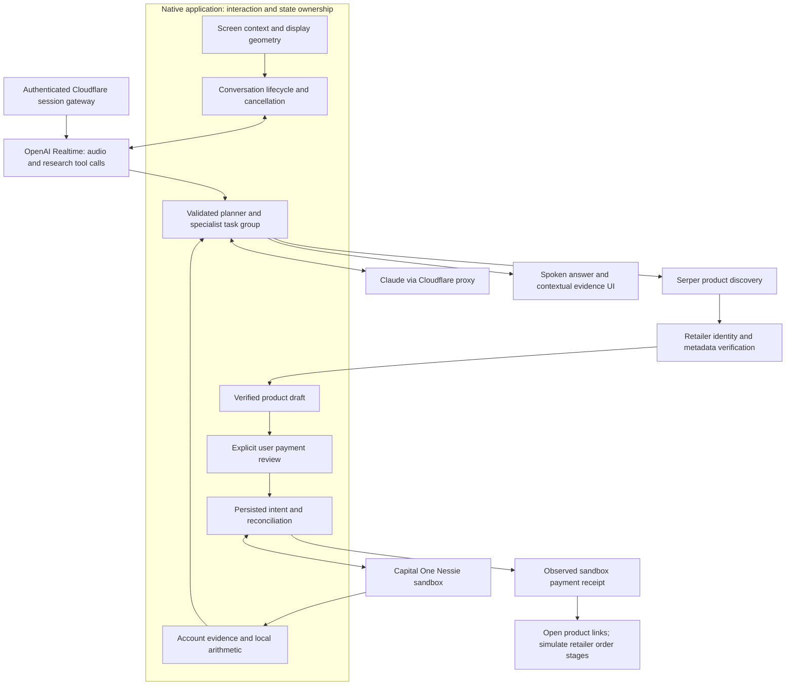

# PeppaPrice: architecture presentation plan

## The thesis

**PeppaPrice coordinates screen context, realtime conversation, parallel financial analysis, verified product evidence, and recoverable sandbox execution at the moment a spending decision happens.**

Lead with the coordination problem. A single question—“Can I afford this, and is there a better option?”—crosses systems with different latency, reliability, and authority. Screenshots describe what the user sees. Nessie supplies synthetic financial records. Models interpret intent and explain tradeoffs. Retailer pages supply product evidence. Only the reviewed checkout flow can submit a sandbox debit.

The impressive engineering story is how those parts remain coherent when the user interrupts, switches accounts, encounters ambiguous product metadata, or loses a payment response.

This document proposes a presentation structure, not new implementation. “Planes” and pattern names below are explanatory groupings of existing code, not separately deployed services. Future work is explicitly identified.

## Opening: make the engineering problem concrete

Say:

> “One question crosses a screen-capture system, a realtime audio session, parallel research requests, account records, and retailer metadata. The hard part is keeping the answer attached to the right evidence—and keeping an interrupted or uncertain operation from becoming the wrong action. PeppaPrice brings those systems into one native financial workflow.”

Then show the product asking about an actual item. The architecture explanation should answer a question the audience now has: **how can that small interaction coordinate so much work?**

Avoid starting with a list of APIs. Introduce each technology when its responsibility becomes visible.

## The architecture reveal: six responsibilities

| Responsibility | Actual mechanisms | Design rationale | Visible payoff |
| --- | --- | --- | --- |
| **1. Native context acquisition** | ScreenCaptureKit display capture; cursor-display labeling; point/pixel geometry; AppKit overlays; global push-to-talk | Carry the user's current screen into the conversation without manually transferring a product description | Ask about an item already open on screen |
| **2. Realtime interaction** | AVFoundation PCM conversion; WebSocket audio; short-lived session credentials; explicit input commit; playback-buffer accounting | Coordinate recording, provider response, and audible completion as distinct lifecycle events | Speech starts incrementally and can be interrupted |
| **3. Bounded reasoning orchestration** | Realtime research tool; Claude planner; validated role/metric selections; up to three task-group specialists; synthesis | Decompose multi-factor questions while bounding work and retaining request ownership | Affordability and Tradeoffs appear as actual concurrent tasks |
| **4. Financial evidence** | Nessie ownership checks; concurrent record reads; integer-cent normalization; locally calculated panels; timestamps and response hashes | Anchor displayed financial values to inspectable records and explicit assumptions | Expand the bills and reproduce the cash estimate |
| **5. Product evidence and draft state** | Retailer URL resolution; page-identity matching; structured metadata; stock/price/image eligibility; persistent basket | Require specific product evidence before treating a listing as a checkout candidate | Actual retailer products with quantities and a coherent subtotal |
| **6. Reviewed execution and recovery** | Immutable checkout draft; actor-isolated ledger; file lock; persisted submission intent; UUID memo reconciliation | Preserve the reviewed amount and handle uncertainty after a network mutation | One sandbox debit with pending/posted state and a receipt |

### Diagram to show



Explain the boundaries while pointing: “Models receive evidence and return findings. Local code owns the displayed arithmetic, product eligibility, and payment lifecycle.” Natural-language answers still require checking against evidence; local arithmetic does not make all model output deterministic.

## The five engineering moments to emphasize

### 1. Parallel research with cancellation isolation

**Technical phrase:** bounded fan-out/fan-in orchestration with generation-scoped result publication.

**Plain meaning:** split the question into a few perspectives, collect the findings, and prevent an old question's answer from appearing after the user has moved on.

The planner selects allowed roles and evidence keys. Swift filters invalid selections, deduplicates roles, caps the group at three, and uses deterministic fallback routing for recognized multi-factor requests. Specialists run through `withTaskGroup`. Resetting research changes a UUID; result publication checks the generation and cancellation state. A failed specialist yields an unavailable result rather than invented findings.

Say:

> “The specialists are real concurrent requests with bounded roles. Each result belongs to a research generation, so cancellation invalidates old work before it can enter the next answer.”

Show two specialist states, then their supporting evidence. Do not describe them as independently browsing agents: they analyze supplied context and have no independent web tool. Different prompts over shared evidence do not establish independent factual confirmation.

Source: [FlickyResearch.swift](../flicky-swift/leanring-buddy/FlickyResearch.swift).

### 2. Realtime completion is more than a finished response

**Technical phrase:** asynchronous input, inference, and playback lifecycle coordination.

**Plain meaning:** the server finishing its answer and the person finishing hearing it happen at different times.

The client manages microphone input, connection setup, pending input bytes, research callbacks, streamed output, and queued playback buffers. It converts microphone audio to 24 kHz mono PCM16. Typed questions use the same response lifecycle without opening the microphone. Turns have recording/time/tool-call limits; cancellation changes the generation and tears down pending work.

Say:

> “We track network completion separately from queued audio playback. That distinction matters for interruption, UI state, and whether a completed conversation turn should enter history.”

Demonstrate Stop during speech. State the configured bounds if asked: 30 seconds of recording, 120 seconds per turn, and at most two research tool calls. These are resource bounds, not latency benchmarks.

Sources: [RealtimeVoiceClient.swift](../flicky-swift/leanring-buddy/RealtimeVoiceClient.swift), [session gateway](../flicky-swift/realtime-worker/src/index.ts).

### 3. Financial context is a calculation with provenance

**Technical phrase:** account-validated evidence normalization with deterministic financial projections into the UI.

**Plain meaning:** show where the values came from and exactly how the app combined them.

The native client validates customer/account relationships and normalizes monetary records into integer cents. Its current estimate is:

```text
safeToSpend = max(0, balance − qualifying next-14-day bills − $500 reserve)
```

Required-record failure makes the snapshot unavailable; purchase-category availability is tracked separately from an empty purchase history. The inspector exposes observation time, redacted responses, and response hashes. Account changes clear prior context.

Say:

> “The model chooses which evidence matters. Swift calculates the displayed values from the selected account's records, and the inspector lets you trace the calculation back to the response.”

Show the arithmetic with actual refreshed values. Describe the reserve as an application assumption and Nessie as a sandbox. Response hashes support traceability; they are not bank signatures. The separate Electron implementation has an event-by-event daily forecast, but that algorithm is not the current native calculation.

Sources: [NessieAPIClient.swift](../flicky-swift/leanring-buddy/NessieAPIClient.swift), [FinancialModels.swift](../flicky-swift/leanring-buddy/FinancialModels.swift).

### 4. Product discovery becomes a verified state transition

**Technical phrase:** identity-bound evidence promotion from search candidate to eligible basket option.

**Plain meaning:** finding a search result and knowing which product its price belongs to are different tasks.

The resolver reads structured retailer metadata and binds it to the requested page. This matters because a page may contain recommended products with unrelated prices. Basket eligibility checks a direct retailer link, valid positive USD price, title, secure image, and availability classified as in stock. Checkout additionally requires a non-future observation younger than 15 minutes. The strict price parser rejects ranges, installments, and foreign-currency snippets.

Say:

> “A search snippet never becomes payable merely because the model found it. We verify the retailer product identity and metadata, then enforce freshness before checkout.”

Show one basket item beside its actual retailer page. The claim is evidence-backed eligibility within supported metadata, not guaranteed inventory or universal retailer support. Shipping, tax, and variants still require retailer confirmation.

Sources: [ProductPageResolver.swift](../flicky-swift/leanring-buddy/ProductPageResolver.swift), [ShoppingBasket.swift](../flicky-swift/leanring-buddy/ShoppingBasket.swift).

### 5. Payment ambiguity is an explicit state

**Technical phrase:** durable intent-before-effect submission with local serialization and reconciliation-based duplicate suppression.

**Plain meaning:** if the bank accepts a request but the response disappears, retrying the payment could charge again. Preserve the original attempt and check what happened.

The coordinator freezes a reviewed basket/account snapshot with a checkout UUID. The actor ledger serializes payment work; a POSIX lock coordinates local processes, and state reloads under the lock. It validates ownership and funds, persists a `submitting` entry, then issues one Nessie withdrawal. Subsequent attempts for that UUID reconcile using its memo and observed account/withdrawal state. Unresolved attempts block another submission on that account.

Say:

> “Before the network mutation, we persist what the user approved. If the outcome becomes ambiguous, the application reconciles that same attempt rather than blindly issuing another debit.”

Use this conceptual sequence in the technical appendix:

```text
Reviewed draft
  → durable submission intent
  → sandbox request
  → observed response / uncertain outcome
  → reconcile the existing attempt
  → retain receipt and continue the demo workflow
```

This is the strongest distributed-systems discussion in the project. It is not provider-guaranteed exactly-once processing, a distributed transaction, or a real merchant purchase. Cart/order steps remain simulated after the sandbox debit.

Sources: [DemoCheckoutLedger.swift](../flicky-swift/leanring-buddy/DemoCheckoutLedger.swift), [ShoppingCheckout.swift](../flicky-swift/leanring-buddy/ShoppingCheckout.swift).

## Presentation sequence

Use these as six storyboard beats, scaled to the actual presentation slot. The existing [demo guide](peppaprice-hackrice-pitch-guide.md) supplies a timed product script.

| Beat | Screen | Point to land |
| --- | --- | --- |
| 1. The decision | Product page, pig, one spoken question | Financial context belongs where spending decisions happen |
| 2. The evidence | Bills/reserve calculation and specialist states | The answer combines multiple perspectives with inspectable values |
| 3. The architecture | Six-responsibility diagram | A small interface coordinates several systems and authority boundaries |
| 4. The verification | Basket item beside retailer metadata | Discovered information must qualify before entering an action draft |
| 5. The execution | Payment review and actual sandbox outcome | State survives uncertainty around a financial mutation |
| 6. The impact | Return to the user's completed decision | Less manual transfer between account records, product comparisons, and a reviewable next step |

Spend the technical explanation on ownership, eligibility, cancellation, and recovery. Those mechanisms establish depth more effectively than displaying a crowded diagram without explaining its edges.

## A dense 60-second architecture answer

> “PeppaPrice coordinates multimodal context, bounded reasoning, and reviewed sandbox execution in a native Swift application. ScreenCaptureKit supplies display context, and OpenAI Realtime handles speech and text through one cancellable session lifecycle. Detailed requests call a research tool that routes into Claude planning, up to three concurrent specialists, and synthesis.
>
> “The app validates Nessie account ownership and calculates the displayed financial evidence in integer cents. Shopping results pass retailer identity, structured metadata, price, stock, and freshness checks before checkout eligibility. Payment runs through a separate ledger: immutable review snapshot, actor and file-lock serialization, persisted intent before the POST, and reconciliation for ambiguous outcomes.
>
> “The user sees one conversation. Underneath, the application decides which evidence can support an answer and which state can authorize a sandbox action. The payment changes Nessie sandbox records; retailer orders are explicitly simulated.”

## Framework vocabulary that is earned by the code

| Use this term | Explain it as | Avoid implying |
| --- | --- | --- |
| Structured concurrency | Related specialist tasks are created and collected within a task-group scope | A separate distributed agent cluster |
| State machine | Voice and checkout have explicit lifecycle states and guarded transitions | A formally verified protocol |
| Deterministic financial evidence | The same accepted inputs and formula produce the same displayed calculation | All generated advice is deterministic or correct |
| Provenance | Source paths, returned records, timestamps, and response hashes | Cryptographically signed bank attestation |
| Durable intent | Save the attempted operation before sending its side effect | A general event-sourcing platform |
| Reconciliation | Read provider state to resolve an uncertain prior attempt | Guaranteed exactly-once API execution |
| Short-lived credentials | Mint a temporary voice credential through an authenticated gateway | Every endpoint has equivalent authentication controls |
| Evidence-driven eligibility | Validate product metadata and freshness before review | A complete merchant inventory or payment integration |

## Impact: make the mechanism measurable

The current impact claim is that PeppaPrice connects account obligations, a product decision, comparison, and a reviewed next step in one desktop workflow. Measured savings, improved financial health, and lower task time require evaluation.

Propose a baseline comparison: participants perform the same purchase task manually and with PeppaPrice. Measure time to reach a decision, manual app switches, correct identification of upcoming obligations, comprehension of the reserve assumption, and incorrect product selections. Record provider failures and participants who cannot complete the task as outcomes too.

For technical evaluation, measure time to first audible output, time to complete research, product verification success by retailer, stale-result publication after cancellation, and duplicate submission behavior under controlled timeout/crash fixtures. Report observed values and sample sizes; do not invent benchmark numbers for the presentation.

## Future architecture: proposed, not shipped

| Proposed extension | Concrete implementation direction | Why it would justify added complexity |
| --- | --- | --- |
| Unified operation identity | Carry an explicit operation ID across voice, research, product verification, review, and receipts | Make cross-provider failures diagnosable as one user operation |
| Typed action proposals | Replace more bracket markers with versioned schemas containing action type, evidence references, and validation results | Make model-driven navigation and draft creation easier to validate and test |
| Version-bound evidence | Bind drafts to account/product observation versions and revalidate affected prerequisites before submission | Make stale evidence invalidation explicit across the full workflow |
| Authenticated provider boundary | Add client authorization, quotas, and stronger fetch restrictions to the general AI/search proxy | Support public use beyond the private demo deployment |
| Authorized merchant adapters | Separate quote, user authorization, submit, status, and recovery contracts for each supported merchant | Replace simulated retailer stages with provider-backed operations where authorized APIs exist |
| Systematic fault injection | Exercise interruption, malformed metadata, account changes, ambiguous POSTs, and process restarts | Establish recovery behavior under reproducible failures |

Do not add a queue, vector database, agent framework, or orchestration platform merely to lengthen the technology list. Each extension should solve a demonstrated boundary, reliability, or scale problem.

## Closing line

> “PeppaPrice turns a purchase question into a coordinated financial workflow: capture context, assemble evidence, compare options, and preserve the user's intent through a reviewed sandbox action.”

Credit the MIT-licensed native foundation when explaining what the team built. The project-specific story is the financial evidence, research coordination, verified shopping workflow, and recoverable sandbox checkout built on that foundation.
