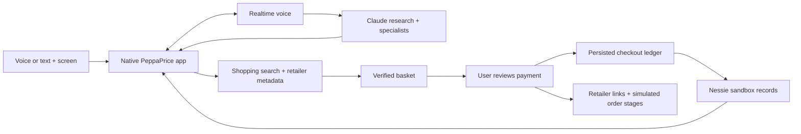

# PeppaPrice: HackRice judging and demo guide

Prepared September 13, 2026 from the supplied HackRice 16 handbook and the local project source. This is a pitch recommendation, not a prediction of judging results. The handbook does not publish numerical rubric weights.

## The recommendation

**Demo one complete purchase decision: screen-aware voice → account-backed explanation → verified multi-store basket → reviewed Nessie sandbox payment.** Show the specialist research as part of that decision, rather than as a separate feature tour.

Positioning: **“PeppaPrice brings your financial context to the moment you’re about to spend.”**

Use the Halloween example you already care about: a student planning a small Halloween gathering needs decorations, candy, and a costume, while keeping upcoming bills covered. It makes the multi-store basket understandable immediately. If those categories do not reliably resolve in rehearsal, use two specific products that do. A complete two-item flow is stronger evidence than three empty categories.

The payoff is a decision the audience can follow: what the user wanted, what the account can support under the stated assumptions, which real items were found, and what changed after a reviewed sandbox payment. The pig gives the experience personality; the connection between those steps gives it substance.

## 1. Timing and track selection from the handbook

The supplied handbook’s **page 24** distinguishes two formats:

| Format | Requirement in the supplied handbook | What to prepare |
| --- | --- | --- |
| Live judging | Three minutes total: two-minute demo and one-minute Q&A; repeated for 3–4 judging visits | Rehearse a 1:50–2:00 presentation, then stop for questions. |
| Devpost video | Mandatory three-to-four-minute video | Use the three-minute script below, or expand toward the handbook’s suggested 3:30 outline. |
| Entries | At most one track; multiple challenges permitted | Choose Finance as the track; prioritize Capital One’s challenge. |

The handbook lists the submission deadline as Sunday 9/13 at 9:00 a.m., with live judging from 9:30 a.m. to noon. These are the supplied document’s times; organizer updates take precedence. The attachment is reference material, not authorization to submit anything on your behalf.

**Best track: Finance.** Pages 19–20 emphasize personal money management, actionable insights, realistic ways to save, and meeting people where they already spend. Your desktop purchase workflow directly demonstrates that brief.

**Best sponsor challenge: Capital One — Best Financial Hack.** Page 12 describes innovative financial applications and Nessie sandbox data. You can demonstrate both account-backed decisions and a persisted sandbox withdrawal. That is a stronger sponsor story than merely placing a Capital One logo in the interface.

**Conditional extra challenge: Lilie Lab AI Challenge.** Page 12 limits it to Rice participants. If your team meets the eligibility rules, the same demo presents a clear AI use case; confirm team eligibility with the organizers.

Do not stretch the submission into unrelated categories. The pig alone is not a game loop. The current voice pipeline is OpenAI Realtime, so old ElevenLabs integration files alone are weak evidence for the ElevenLabs challenge. I did not find a current Persona verification gate in the native flow, so account ownership checks or a banking animation should not be described as meeting its verified-human challenge. The handbook leaves Goldman Sachs details pending, so it cannot support a specific recommendation for that challenge.

## 2. How the recommended demo covers the rubric

These are the five criteria on **page 23**, translated into visible proof. The priority judgments below are editorial, not official scores.

| Criterion | Strongest evidence you have | What the judges should see/hear |
| --- | --- | --- |
| Technical Rigor | Native desktop capture and audio; bounded parallel specialist calls; deterministic financial calculations; retailer metadata verification; recoverable payment ledger | “The model explains the decision. Swift calculates the displayed financial evidence and controls payment state.” Show a source or receipt. |
| Originality & Creativity | Financial guidance attached to the screen where a purchase decision happens, connected to a cross-store basket | Ask “Can I afford this?” without copying a product description into a budgeting app. Then carry the decision into shopping. |
| User Experience & Design | Push-to-talk, contextual evidence, recognizable pig, native panels, real product photographs, one review surface | One short question and a legible answer; then a basket with clear totals and an explicit review step. |
| Practicality & Impact | Visibility into upcoming bills and the reserve before spending; fewer manual comparisons across stores | Explain the specific student problem and show the bill-aware estimate affecting the decision. Avoid unsupported savings statistics. |
| Relevance | Nessie accounts, bills, merchant categories, and withdrawals used for a financial workflow | Say “Capital One Nessie sandbox,” identify the account-backed evidence, and show the sandbox receipt. |

**Why this combination:** each step supports several criteria and follows the same user goal. A separate stock conversation, loan form, account tour, and shopping demo would spend most of the two minutes changing context.

## 3. Feature priority and what to leave for questions

| Priority | Feature | Value to the presentation | Demo treatment |
| --- | --- | --- | --- |
| Essential | Screen-aware, conversational voice | Fastest way to establish how the product fits into daily behavior | Start on an actual product page; ask one question with Control + Option. |
| Essential | Account evidence and affordability estimate | Makes personalization concrete and connects directly to Finance | Show upcoming bills and the balance-minus-bills-minus-reserve calculation. |
| Essential | Verified multi-store basket | Most visually concrete expression of “help me act on the answer” | Show actual titles, images, retailer links, quantities, and subtotal. |
| High value if rehearsed | Reviewed sandbox payment and receipt | Demonstrates stateful API integration beyond a read-only answer | Show review, one sandbox debit, then the receipt/observed balance. |
| High value, embedded | Parallel specialists | Adds technical depth and visible reasoning perspectives | Let Affordability and Tradeoffs work during the first question. Explain them in one sentence. |
| Q&A | API connection inspector | Good answer to “Is this real data?” | Keep the redacted response/provenance panel ready. |
| Q&A / extended video | Spending categories and account switching | Shows breadth and that results come from the selected account | Use one alternate account only if asked. |
| Q&A / backup | Local credit and loan-cost simulation | Useful financial education, but a second story with input setup | Demonstrate only when asked about financial planning beyond shopping. |
| Supporting polish | Pig animation, contextual panels, interruption, keyboard controls | Helps UX without needing a dedicated explanation | Let these be visible; do not narrate every animation. |
| Exclude from main pitch | Stocks and current market recommendations | No current securities-price/news feed is established in this build | Do not promise live stock research, trading, or return forecasts. |
| Exclude until integrated and verified | Subscription cancellation work | New files existed during this audit, but no connection from the inspected main manager/panel was found | Treat as work in progress; re-audit before advertising it. |
| Exclude from current native demo | Earlier Electron forecast/OCR implementation | Interesting engineering, but different runtime and calculation behavior | Use it in the technical appendix, not as a native feature claim. |

## 4. Live judging: two-minute run of show

Rehearse with two people if available: one speaks, one operates. With one presenter, reduce narration and use the same fixed window arrangement each time. These are timing targets, not measured provider latency.

| Time | Screen/action | Presenter’s job |
| --- | --- | --- |
| 0:00–0:12 | Actual product page and cursor companion visible | Name the project, team, track, and one purchase problem. |
| 0:12–0:40 | Hold Control + Option; ask the purchase question; show evidence/specialists | Give the app a short speaking window. Point to upcoming bills and the reserve. |
| 0:40–1:08 | Open the basket prepared and freshly checked before the demo | Show two or three real products and retailer names. Say that the list was prepared earlier. |
| 1:08–1:38 | Click Buy it, review account/subtotal, then confirm the sandbox amount | Show the actual outcome. If pending, show pending and explain reconciliation. |
| 1:38–1:55 | Receipt or account panel visible | Explain the deterministic calculation, ledger, and practical benefit. |
| 1:55–2:00 | End on the product, not the code editor | Stop and invite questions. |
| 2:00–3:00 | Q&A | Use evidence/source panels only as needed. |

### Spoken script for the live slot

Approximately 210 spoken words before team names and substitutions. Leave time for the app’s audio and clicks; do not speak over its response.

> We’re [team names], and this is PeppaPrice, our Finance-track project. Imagine planning a Halloween gathering while rent and other bills are coming up. A price tag only tells you part of the story.
>
> PeppaPrice lives beside your cursor. I can ask, “Can I afford this? Show my upcoming bills and explain the tradeoffs.”
>
> [Let the app answer briefly; point to the evidence.]
>
> It uses this selected Capital One Nessie sandbox account. The displayed estimate subtracts upcoming bills and a five-hundred-dollar reserve. Separate AI specialists examine affordability and tradeoffs, while the app calculates the numbers.
>
> Here’s the Halloween list we prepared earlier. These are actual retailer products with photos, direct links, prices, and published in-stock status. Items without that evidence are left out. I can compare products from multiple stores in one basket.
>
> Now I review the account and total, then approve a sandbox payment. PeppaPrice records one Nessie withdrawal. Store links open, while retailer cart and order steps are explicitly simulated.
>
> [Show the receipt, or use the pending-payment line below.]
>
> The ledger saves payment intent before sending and reconciles uncertain results without automatically submitting the debit again.
>
> We built the financial and shopping workflow on an open-source native desktop foundation, using Swift, Realtime voice, Claude, and Cloudflare. The goal is simple: help people make a better spending decision while they’re making it. We’re happy to show the underlying evidence.

**If payment is pending:** “Nessie hasn’t confirmed the final outcome yet. The app keeps that state visible and checks the existing payment instead of blindly charging again.” Do not say the balance changed unless the fresh account response shows it.

**If voice is slow:** at the rehearsed cutoff, stop the response and open the existing evidence/basket. Say, “I’ll show the prepared result while the service catches up.” If the evidence shown is from an earlier run, identify it that way.

## 5. Three-minute Devpost video script

Target 3:00–3:15, with roughly 335 spoken words and room for screen actions and a short app response. The handbook’s recommended outline totals 3:30; this shorter version still falls within its stated three-to-four-minute requirement. Add team names and record a timed rehearsal.

### 0:00–0:25 — Problem and introduction

> I’m [name], with [team names]. We built PeppaPrice for the Finance track and Capital One’s Best Financial Hack.
>
> Imagine buying decorations, candy, and a costume for Halloween. You can compare prices, but you still need to work out what those purchases mean for your upcoming bills. PeppaPrice brings that financial context to the screen where you’re shopping.

### 0:25–1:05 — Screen, voice, and financial evidence

> It’s a native Mac companion beside your cursor. I hold Control and Option and ask, “Can I afford this? Show my upcoming bills and explain the tradeoffs.”
>
> [Play a brief actual response.]
>
> It sees the product on screen and uses the selected Capital One Nessie sandbox account. This panel shows the balance, upcoming bills, and a five-hundred-dollar reserve. Swift calculates the displayed estimate; the model explains it. Affordability and Tradeoffs specialists contribute separate analyses.

### 1:05–1:45 — Verified shopping

> Next, I ask for a Halloween shopping basket. [Show the actual request and resulting list; disclose any wait-time cut.]
>
> PeppaPrice searches listings, reads retailer product metadata, and checks relevance. The basket requires a direct product link, photo, positive dollar price, and explicit published in-stock status. Missing matches stay out.
>
> Here are the selected products across these stores, with quantities and one subtotal. It picks the lowest-priced eligible match among the results it verified, before shipping and tax.

### 1:45–2:20 — Reviewed sandbox action

> I review the account and total before confirming. This submits one withdrawal to Nessie’s sandbox. The retailer links open, and the cart and order stages are simulated; no real retailer purchase happens.
>
> [Show the actual receipt and observed balance, or the pending state.]
>
> A persisted ledger records intent before sending. If the response is uncertain, the app checks the existing payment instead of automatically posting another debit.

### 2:20–3:00 — Engineering, originality, and impact

> We combined SwiftUI and AppKit with screen capture, OpenAI Realtime voice, Claude research, and Cloudflare gateways. Our financial evidence, verified basket, and payment recovery build on the MIT-licensed desktop desktop foundation.
>
> PeppaPrice helps connect a purchase to the obligations behind the account balance, and gives the user a concrete next step. Next, we’d test whether it improves spending decisions and add authorized merchant checkout integrations. Today, the complete sandbox workflow shows how that experience can work.

If the voice response changes the conclusion, adapt the narration to it. Do not script an “affordable” verdict when the selected account’s evidence says otherwise.

## 6. What to prepare before presenting

### Fixed demo state

1. Launch the current **flicky-swift** app, not the earlier Cappy/Electron app. Use Xcode for any full native build; the repository prohibits terminal `xcodebuild`.
2. Grant and test screen recording/capture, microphone, and Accessibility permissions before recording. Test Control + Option and the Stop action in the room’s audio conditions.
3. Choose one sandbox account with meaningful upcoming bills and enough account funds for the planned sandbox payment. Refresh it; note the actual balance, qualifying bills, reserve, and subtotal privately for rehearsal.
4. Use a product page with a clearly visible item and price. Keep unrelated personal windows out of the captured displays. Current screen context can be sent to model services.
5. Prepare two or three eligible products from at least two retailers if available. Confirm title relevance, costume size/variant if applicable, real images, stock metadata, and actual links. Do not force a three-store claim if only one retailer verifies.
6. Refresh products near the demo: checkout eligibility uses a 15-minute freshness window, and old items may need network rechecks. There is no manual “Check products” step in the current basket.
7. Keep the main evidence panel, basket, and API/receipt details reachable without searching through menus. Command + Shift + Space opens the main panel; Options → Shopping basket opens the basket.
8. Record a short backup of your actual successful run. Label it as recorded if used live. Do not substitute a fixture animation and describe it as a live API result.
9. Practice all three branches: successful payment, pending payment, and service unavailable. Sandbox withdrawals affect later demos, so refresh between judging visits and recheck funds. Do not expect a completed basket to remain populated: paid lines can be cleared.

### Prompts to rehearse

- Purchase evidence: **“Can I afford this? Show my upcoming bills and explain the tradeoffs. Keep the spoken answer to two sentences.”**
- Explicit specialist request if needed: **“Use affordability and tradeoff specialists to review this purchase.”**
- Shopping preparation: **“Find one adult medium Halloween costume, one bag of Halloween candy, and one Halloween decoration. Put relevant in-stock products with verified retailer prices in a shared basket.”** Adjust size and budget to the actual scenario. Broad categories may resolve slowly or return nothing.
- Reopen: **“Show my shopping basket.”** The menu is the more predictable demo control.

Do not wait on a fresh three-category search during the two-minute live slot. Categories are searched sequentially, retailer reads have timeouts, and there is another relevance-selection call. Show the live discovery step in the longer video, or show its recorded execution with a disclosed cut through waiting time.

### Evidence worth keeping one click away

| Claim | Best visible proof |
| --- | --- |
| “The account data comes from Nessie.” | API connection details with selected customer/account, request path, status, observation time, and redacted returned data. |
| “The financial estimate is explainable.” | Balance minus next-14-day bills minus $500 reserve, floored at zero. |
| “The products are actual retailer items.” | One product’s direct page next to the basket title, photo, and observed price. |
| “The payment changes sandbox state.” | Withdrawal receipt and refreshed account balance; distinguish pending from posted. |
| “These specialists are real requests.” | Research task states and the task-group implementation, if asked. |
| “We thought about recovery.” | Existing ledger/checkouts tests covering ambiguous outcomes, repeat submission, and persisted recovery. Do not deliberately damage the live demo to prove this. |

## 7. Repository and technology audit

The accessible workspace contains multiple implementations and supporting services. This audit covers those local components; it does not establish the contents of other teammates’ remote repositories or deployment parity. Current source takes precedence over inherited READMEs where they disagree.

| Component | Technology and responsibility | How to describe it |
| --- | --- | --- |
| `flicky-swift/leanring-buddy/` | Swift, SwiftUI, AppKit, Combine; menu bar, native panels, cursor companion, application state | The current PeppaPrice app. |
| Native screen/audio | ScreenCaptureKit, Core Graphics, AVFoundation; display images, global push-to-talk, audio capture/conversion/playback | Context and interaction at the desktop purchase decision. |
| `RealtimeVoiceClient.swift` | Foundation WebSocket; `gpt-realtime`, Marin; audio input/output, typed input, history, research tool, cancellation | Current speech-to-speech interface, also used for typed/suggestion replies. Push-to-talk, not a continuously listening assistant. |
| `flicky-swift/realtime-worker/` | TypeScript Cloudflare Worker; authenticated session endpoint; 60-second client credential; server-held OpenAI key | Short-lived voice-session access. Configured audio is 24 kHz PCM with output speed 0.9. |
| `flicky-swift/worker/` | TypeScript Cloudflare proxy; Claude, Serper shopping search, page fetch; legacy speech routes also present | AI reasoning and product discovery infrastructure. Legacy routes are not all active voice dependencies. |
| `ClaudeAPI.swift` / `FlickyResearch.swift` | Claude client, planner, allowed specialist roles, up to three concurrent tasks, synthesis/evidence routing | Custom bounded research orchestration in Swift; no need to claim an agent framework you do not use. |
| `NessieAPIClient.swift` / `FinancialModels.swift` | Account ownership validation, account/bill/transaction requests, integer-cent normalization, local evidence | Live API reads of synthetic sandbox records. |
| `ProductPageResolver.swift` | HTTPS retailer reads, identity-bound structured metadata, JSON-LD/retailer-specific parsing | Verification before basket insertion; not universal inventory access. |
| Basket and checkout files | Codable persistence, SwiftUI review, task groups, immutable payment draft, actor ledger, file lock, UUID memo, reconciliation | A unified shopping view plus a recoverable sandbox payment demonstration. |
| `CreditSimulation*.swift` | Local amortization calculations, score-input teaching model, comparisons, opt-in account-scoped history | Educational loan-cost scenarios; no credit-bureau pull or lender approval. |
| `scripts/seed_peppaprice_accounts.py` | Python; journaled creation of ten synthetic customers/twenty checking and savings accounts | Repeatable varied demo data. The index stores IDs; displayed financial values are fetched from Nessie. |
| Other root `scripts/` | Python seeding, read-only Nessie verification, cohort generation; JS builds/benchmarks | Development and validation support, not extra native product features. |
| Root `src/` + `package.json` | Earlier Electron/React/TypeScript app; Fastify, Zod, Tesseract.js OCR; deterministic event-based forecast engine | Earlier implementation. Its detailed 14-day balance walk is not the current native safe-to-spend formula. |
| `macos/cappy/` + `macos/peppaprice-worker/` | Earlier native Cappy integration and proxy | Prior iteration; do not launch it for the current demo. |
| Tests/checks | Swift fixture executables, Worker Node tests/TypeScript checking, root Vitest and integration tooling | Existing evidence of failure-case engineering. This documentation audit did not rerun all suites or execute a fresh payment. |

### The architecture sentence to remember

**“The native app collects context and owns state; model services explain and research; Swift calculates the displayed financial evidence and validates products; a separate ledger controls the reviewed sandbox debit.”**

### Technical details that are worth explaining if asked

- **Bounded concurrency:** two or three specialist roles analyze the supplied evidence concurrently. A request-generation boundary prevents cancelled results from landing in a later conversation. Specialists do not independently browse the web.
- **Separation of reasoning and arithmetic:** the model can request evidence types; the app populates their values from financial state. The native estimate does not include inferred future salary or unknown living costs.
- **Verification before presentation:** raw shopping snippets are insufficient. Basket candidates need a direct HTTPS product URL, positive exact USD price, photo URL, and explicit in-stock metadata; a relevance pass rejects wrong-category results. Published metadata can still be stale or incomplete, and fit/variants need review.
- **Conservative payment recovery:** save intent before POST; use a checkout UUID in the memo; lock local submission; reconcile uncertain outcomes rather than automatically repeat a debit. This is local duplicate suppression and recovery, not a claim of distributed exactly-once merchant payments.
- **Honest state:** unavailable evidence, missing products, pending payments, and simulated merchant orders remain distinguishable from success.

## 8. Likely judge questions and short answers

**“What makes this more than a chatbot?”**

“It connects the screen I’m shopping on to selected-account evidence, then turns product research into a verified basket and reviewed sandbox action. The app owns the financial calculations and payment state, so the outcome is more than generated advice.”

**“What is real and what is simulated?”**

“Voice and research use live model services; products come from retrieved retailer metadata; financial records and withdrawals use Nessie’s real sandbox API. The customers and money are synthetic. Retailer cart and order steps are simulated.”

**“How do you calculate what someone can spend?”**

“The native estimate is account balance minus qualifying bills in the next fourteen days minus a five-hundred-dollar reserve, floored at zero. It is a transparent starting estimate; it does not account for every living expense or unposted charge.”

**“Does checkout enforce that reserve?”**

“The estimate informs the decision. Checkout separately validates account identity and available account funds. I would not describe it as a reserve-preserving spending lock.”

**“Are those the cheapest products anywhere?”**

“They are the lowest-priced eligible matches among the results we retrieved and verified, before tax and shipping. We do not search every retailer or guarantee the global lowest delivered price.”

**“What if a merchant blocks your product check?”**

“That product is omitted instead of turning an unverified snippet into a purchasable item. Broader authorized catalog integrations are a next step.”

**“What if the payment request times out?”**

“The submission intent is already on disk. The app reconciles that checkout’s memo and account evidence; it does not automatically POST the withdrawal again. Unconfirmed results stay pending.”

**“What did your team build versus reuse?”**

“We reused the MIT-licensed desktop desktop foundation, including capture, overlays, and push-to-talk plumbing. Our project adds financial account evidence, research coordination, verified shopping, recoverable sandbox checkout, and the PeppaPrice experience.” Confirm the precise hackathon-time contribution against your team’s actual work history; source presence alone cannot establish when something was built.

**“Why both OpenAI and Claude?”**

“Realtime handles the spoken interaction. Its research tool uses Claude for contextual analysis and bounded specialist work. The app coordinates their outputs and maintains authoritative state.”

**“Is all financial data local/private?”**

“Calculations and recovery records are local, but screenshots and financial context can be sent to the configured model services. Long-lived AI provider keys are kept in Workers; this prototype still needs production access-control and privacy hardening.”

**“Can it scale?”**

“The gateways use Workers and the app bounds specialist and retailer concurrency. We have not demonstrated production scale. Provider latency, model cost, retailer access, per-user authentication, and merchant/payment integrations are the next constraints to address.”

**“How do you know it helps?”**

“We’ve demonstrated the workflow; we haven’t measured improved financial outcomes yet. Next we’d compare time to a correct bill-aware purchase decision, understanding of remaining headroom, and product-verification success against manual shopping.”

## 9. Claims to keep precise

| Use this wording | Avoid this claim |
| --- | --- |
| “Live Nessie sandbox data.” | “Connected to my production Capital One bank account.” |
| “Account ownership validation.” | “Identity verification by Persona/Plaid.” |
| “Published retailer price and in-stock metadata.” | “Guaranteed available at final checkout.” |
| “One reviewed sandbox withdrawal.” | “Automatically paid every retailer.” |
| “Links open; retailer orders are simulated.” | “Agents completed real purchases.” |
| “Parallel specialist analyses.” | “Independent browsing agents verified everything.” |
| “Local loan-cost simulation.” | “We pulled a credit score or secured loan approval.” |
| “Screen-aware financial companion.” | “Always watching and automatically preventing overspending.” |
| “Designed to reduce comparison and budgeting effort.” | “Proven to save users $X or Y%.” |
| “Built on an attributed open-source desktop foundation.” | “We created all of the native interaction infrastructure from scratch.” |

## 10. Source trail and audit boundaries

**Judging source:** supplied `HackRice 16 Hacker Handbook-2.pdf`, pages 12 (Capital One/Lilie), 19–20 (Finance), 23 (rubric), 24 (submission/live timing); Persona and ElevenLabs context on pages 11 and 17. Relevant judging/format pages were rendered and visually inspected. No numerical weighting was found.

**Current native source:** [CompanionManager.swift](../flicky-swift/leanring-buddy/CompanionManager.swift), [RealtimeVoiceClient.swift](../flicky-swift/leanring-buddy/RealtimeVoiceClient.swift), [FlickyResearch.swift](../flicky-swift/leanring-buddy/FlickyResearch.swift), [NessieAPIClient.swift](../flicky-swift/leanring-buddy/NessieAPIClient.swift), [ShoppingBasket.swift](../flicky-swift/leanring-buddy/ShoppingBasket.swift), [ProductPageResolver.swift](../flicky-swift/leanring-buddy/ProductPageResolver.swift), [ShoppingCheckout.swift](../flicky-swift/leanring-buddy/ShoppingCheckout.swift), [DemoCheckoutLedger.swift](../flicky-swift/leanring-buddy/DemoCheckoutLedger.swift), [Realtime gateway](../flicky-swift/realtime-worker/src/index.ts).

**Supporting references:** [root project overview](../README.md), [shopping behavior](../flicky-swift/design/shopping-basket.md), [voice/account behavior](../flicky-swift/design/unified-voice-and-demo-accounts.md), [credit simulation assumptions](../flicky-swift/design/credit-simulation.md), [Nessie demo inspector guide](nessie-judge-demo.md), [earlier forecast engine](../src/domain/forecast.ts), [native foundation license](../flicky-swift/LICENSE).

The root README still mentions a manual product-check action in one section; current basket source/design documentation removes it. The Realtime README mentions a legacy fallback that current manager behavior no longer uses. Earlier status/attribution documents say live Nessie was absent; that describes an older implementation, not the current native app. This guide resolves those discrepancies using current code. No new product search, live voice session, sandbox withdrawal, production purchase, or full build was performed for this documentation task. Features being changed concurrently should be rehearsed in the final running build before recording.
